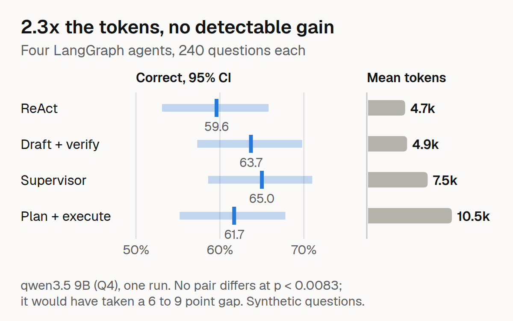
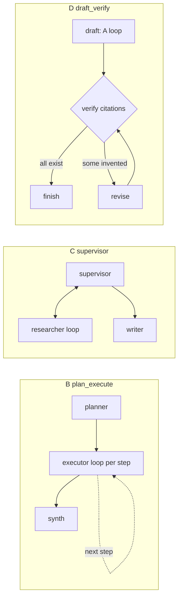

# Agent Shootout



Four LangGraph agent designs answer the same 240 questions about Japanese statutes, with the same tools, the same base prompt, the same local model and the same token budget, and are compared on **correctness and cost** with paired tests. The protocol and five hypotheses were fixed before the test split was run ([`docs/PREREGISTRATION.md`](docs/PREREGISTRATION.md), commit `956b41c`).

> **Result in one line:** the designs are not distinguishable on accuracy (59.6% to 65.0% correct, no pair clears the pre-registered threshold), but they differ 2.3x in cost: plan-and-execute uses 10,535 tokens per question where a plain ReAct loop uses 4,663.
> **Scope:** synthetic questions generated from statute headings, one 9B model (qwen3.5 Q4_K_M, temperature 0), one prompt set, one run. "Correct" is a **citation check** (every gold article cited, no invented article), not a check that the answer is right. Nothing here measures legal accuracy or gives legal advice.

Full tables, the hypothesis scorecard, the post-hoc analysis and the limits: [`results/REPORT.md`](results/REPORT.md). Per-question data: [Hugging Face dataset `raihan-js/agent-shootout`](https://huggingface.co/datasets/raihan-js/agent-shootout).

## The four designs

All four share the same three tools (`search_articles`, `get_article`, `verify_citation`) over a registry of 11 laws and 4,778 articles fetched from the e-Gov Law API, the same base prompt, and the same budget (24,000 tokens, 20 model calls per question).
Diagrams are generated from the compiled graphs (`scripts/render_graphs.py`, `docs/graphs/*.mmd`).

| | Design | Shape |
|---|---|---|
| A | **react** | one model-and-tools loop (8 iterations) |
| B | **plan_execute** | a planner writes up to 3 steps, an executor loop runs each, a synthesiser writes the answer |
| C | **supervisor** | a supervisor routes between a researcher loop and a writer, up to 3 rounds |
| D | **draft_verify** | a draft (the A loop), then a symbolic check of every citation against the registry, then up to 2 revisions |



D's check uses the same registry as the scoring, so its invented-citation rate is low **by construction**; it cannot see a real but wrong article, which is most of what goes wrong (87% to 95% of every design's wrong answers).

## Questions and scoring

Questions do **not** name the article (an earlier benchmark's did, which makes search trivial). 120 items (40 per type), each asked in Japanese and English. Three types: *topic* ("which article of the Civil Code covers X?"), *neighbour* ("which article comes right after the one on X?", which needs `get_article` navigation) and *pair* (two topics, two articles). Gold articles come from the registry; **there is no language-model judge anywhere**: scoring is symbolic (a single-pass citation extractor, an existence check, deleted articles count as invented).

## Results (240 test questions per design)

| | A react | B plan-execute | C supervisor | D draft-verify |
|---|---|---|---|---|
| **Correct** [95% CI] | 59.6% [53.1, 65.8] | 61.7% [55.2, 67.8] | 65.0% [58.6, 71.0] | 63.7% [57.3, 69.8] |
| Answers with an invented citation | 2.9% | 0.8% | 2.9% | 0.4% |
| **Mean tokens per question** | 4,663 | 10,535 | 7,494 | 4,905 |
| Tokens per correct answer | 7,826 | 17,084 | 11,530 | 7,694 |
| Latency p50 (s, 4 in flight) | 14 | 40 | 31 | 16 |
| Correct on pair questions (80) | 41.2% | 48.8% | 48.8% | 47.5% |

- **No pair of designs differs on correctness** at the pre-registered threshold (0.05 / 6 = 0.0083); the smallest p is 0.0525 (react vs draft-verify). The test could only have called a pair different at a gap of about 6 to 9 points, so differences up to that size are not ruled out.
- **Cost separates them.** React and draft-verify dominate plan-and-execute and the supervisor under the pre-registered rule (no detectably worse correct rate and a lower mean cost with non-overlapping bootstrap intervals).
- **The pre-registered predictions held, one half-held:** all four within 10 points; cost ordered A < D < C < B with B at least twice A; invented citations under 5%; most wrong answers cite a real but wrong article; ReAct and draft-verify skip the tools in 11% and 7% of runs. Plan-and-execute was **not** the one that helped on pair questions (tied with the supervisor).
- **Noise floor:** running the same 36 dev questions twice with identical settings changed correctness on 1 to 5 of them per design and gave identical answer text on only 2 to 5 of 36. Differences of a few questions between designs are inside that.

### What this does not show

- **That a correct answer is right.** In the post-hoc replay of the tool calls, about 8% to 9% of the correct answers of react, supervisor and draft-verify cite a gold article that no tool ever returned to the model (mostly "the article after X": the model guesses the number), and then describe it wrongly. Example: asked for the article after 民法 730, ReAct answers 731 (correct) and says it is about ending a duty of support; 731 is the minimum marriage age. No metric here checks what an answer says about an article it cites correctly.
- **That any design is better for real legal research.** Questions are generated from headings, so they are regular; English questions quote the Japanese heading.
- **That the order holds for another model, prompt set or budget.** Prompts were tuned on 36 separate dev questions with equal effort per design (`docs/TUNING.md`); a different prompt could reorder the designs.
- **Anything about gaps under 6 to 9 points,** or that the supervisor's 5-point lead over ReAct (p = 0.085) is real or not.

## Things that went wrong while building it

- **A scoring bug that looked like a model result.** The first dev scores used a citation pattern that needed `第740条`; the model writes `第 740 条` and `民法709条`. 28 plan-execute and supervisor answers scored as "no citation" although they cited correctly. The extractor was fixed (tests added) and the stored runs re-scored from their text; no model was re-run.
- **A phantom-citation bug in an earlier project's extractor, found while writing this scoring:** `JaCite-Bench` reported the prefix of every branch citation (第二条の二 gave both 2-2 and 2) as a second citation. All 1,800 published responses were re-scored and that project's numbers corrected (llm-jp 4.57%, not 4.05%).
- **The first prompt let ReAct and draft-verify answer from memory** without calling a tool (39% to 42% of their dev runs). One shared change ("always use the tools before answering") fixed it for all four designs, not one.
- **A search index that made the task trivial.** Indexing article captions gives recall@5 of 0.98 for a caption query; indexing the text only gives 0.79. The text-only index was chosen on that statistic, before any agent ran.
- **A power loss in the middle of the noise-floor repeat.** The model server died and 14 to 16 questions per design were written as instant connection errors. That attempt is kept (`results/runs/dev3_repeat_interrupted`) and the repeat was re-run in full; the pre-registration was already committed.
- **The tool is picky about article numbers.** `get_article` accepts `415-2` but not `415条の2` or `250の6`, and answers "no such article" for articles that exist; 11 of plan-execute's 34 failed lookups were of this kind. The tool was identical for all designs and was not changed after the pre-registration, so it is part of what was measured.
- **A metric that measured headings.** The pre-registered "unsupported quote" rate is 86% to 90% for every design because the answers quote the statute heading from the question back; it is reported, not used, and a refined post-hoc version is labelled as such.

## Reproduce

```bash
python3 -m venv .venv && .venv/bin/pip install -e ".[dev]"
.venv/bin/python -m pytest tests -q                                  # 42 tests, no model needed (fake LLMs)
.venv/bin/python scripts/build_registry.py                           # optional: rebuild the registry from the e-Gov API (committed: data/registry.json.gz)
ollama pull qwen3.5:9b && scripts/serve_llm.sh                       # llama.cpp server from the Ollama bundle, 4 parallel slots on port 11600
.venv/bin/python scripts/run_test_langsmith.py --out results/runs/test --no-langsmith     # 960 runs, about 2 hours on an RTX 3060 12GB
.venv/bin/python scripts/analyze.py results/runs/test --name test --noise results/runs/dev2 results/runs/dev3_repeat
.venv/bin/python scripts/posthoc.py results/runs/test                # post-hoc checks, labelled as such
.venv/bin/python scripts/rescore_runs.py results/runs/test           # re-score the committed records, no model
```

`scripts/run_test_langsmith.py` without `--no-langsmith` records the run as LangSmith experiments (set `LANGSMITH_API_KEY`); see `results/langsmith_experiments.md`. The model server needs `GGML_BACKEND_PATH` to use the GPU (see `scripts/serve_llm.sh`); without it llama.cpp silently runs on the CPU.

## Layout

`src/shootout/` registry, search, tools, the four graphs, scoring, metrics · `data/` registry, dev (36) and test (240) questions · `docs/` pre-registration, tuning log, generated graphs · `results/` raw runs, analysis, report, post-hoc · `scripts/` run, analyse, export.

## Licence and data

MIT for the code. The statute texts come from the e-Gov Law API v2 (Japanese statutes are not subject to copyright; fetched 2026-10-06); `data/registry.json.gz` is that text, cut into articles. Model: qwen3.5 9B (Apache-2.0), used through a local GGUF. Questions and runs are synthetic and contain no personal data.
